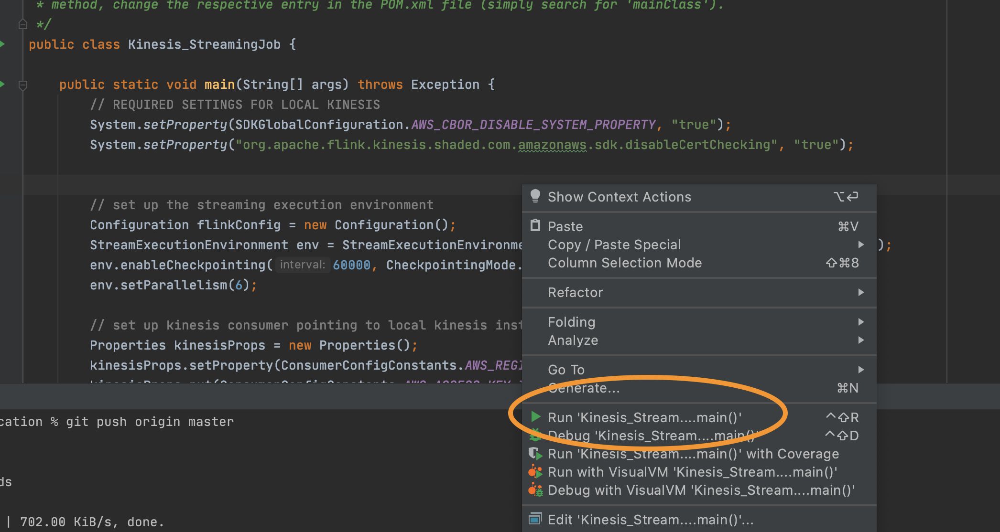

# local-flink-with-docker
Uses Apache Flink docker image with Kinesalite (and maybe Kafka)

1. Clone This Repo
1. [Install IntelliJ](https://www.jetbrains.com/help/idea/installation-guide.html)
1. [Install Docker](https://docs.docker.com/engine/install/)
1. Run included Docker Image
1. Set up local kinesis stream
1. Modify Code Samples
1. Run Code Samples
1. Enjoy


# Install IntelliJ
This is where you will run the code in this repo--you can choose to use any IDE you'd like, but IntelliJ is uniquely suited for running Flink workloads in that it will spin up a mini Apache Flink cluster on your behalf.

[Install IntelliJ](https://www.jetbrains.com/help/idea/installation-guide.html)

# Install Docker 
Docker will allow you to run a Kinesalite image locally on your machine!
 
[Install Docker](https://docs.docker.com/engine/install/)


You also need to [install Docker Compose](https://docs.docker.com/compose/install/) to run the provided docker-compose template.


# Run the docker image
Once you've installed docker, either from your IntelliJ Terminal or your local machine's terminal, navigate to the git project's root and type the following:

```bash
docker-compose up -d
```

This will start your kinesalite process at the following url:
`https://localhost:4567`

The `-d` denotes a DAEMON process.

# Set up local Kinesis Stream

Execute the following two commands in succession in a terminal to create a local stream called `my-local stream` and then publish data under the `--data` field input.

```bash
aws kinesis create-stream --endpoint-url https://localhost:4567 --stream-name my-local-stream --shard-count 6 --no-verify-ssl
```

```bash
aws kinesis put-record --endpoint-url https://localhost:4567 --stream-name my-local-stream --data mytestdata --partition-key 123 --no-verify-ssl
```

# Modify code samples
In `/src/main/java/Kinesis_StreamingJob.java` you can modify the code to point to the specific data stream you have created in the previous step.

# Run code samples

### Note: Ensure you are using Jave 8 or higher, and on your run configuration, include provided sources.



In Intellij, Hit run, and you can continue publishing messages to see the Flink app print out the length of a string passed.


```bash
aws kinesis put-record --endpoint-url https://localhost:4567 --stream-name my-local-stream --data myverylongstringdata --partition-key 123 --no-verify-ssl
```


Please note: the `ssl` folder in this repo is a test credential that is required for running kinesalite locally due to how the AWS CLI works.
